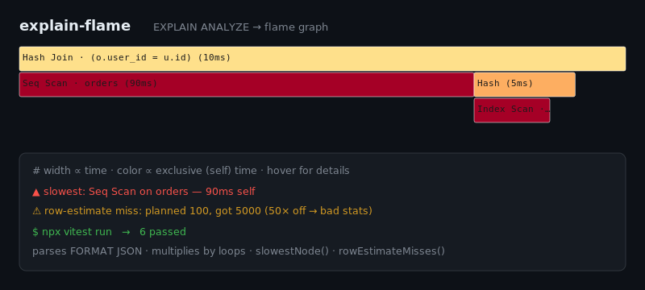

# explain-flame

[](https://github.com/JCreatesGH/explain-flame/actions)
[](https://www.typescriptlang.org/)
[](LICENSE)

Paste a Postgres `EXPLAIN (ANALYZE, FORMAT JSON)` plan and get a **flame graph** — width by time, color by *exclusive* (self) time — that points straight at the node to optimize and the row-estimate misses that cause bad plans.



## Install

```bash
npm install explain-flame
```

## Use it

```ts
import { parseExplain, renderFlame, slowestNode, rowEstimateMisses } from "explain-flame";

const plan = parseExplain(explainJson);          // string or parsed JSON

slowestNode(plan).type;                          // "Seq Scan"  ← burns the most self-time
rowEstimateMisses(plan);                         // nodes where actual rows >> planner estimate
fs.writeFileSync("plan.svg", renderFlame(plan)); // an SVG flame graph
```

Generate the input with:

```sql
EXPLAIN (ANALYZE, FORMAT JSON) SELECT ...;
```

## Why it's useful

- **Self-time, not just totals** — Postgres reports cumulative `Actual Total Time`; this computes each node's *exclusive* time (and multiplies by `Actual Loops`), so the flame graph colors the node actually doing the work, not its parent.
- **Bad-stats finder** — `rowEstimateMisses` flags nodes where actual rows diverge from the estimate by 10×+, the usual root cause of a bad plan.
- **Just an SVG** — no server, no canvas; the output has `<title>` tooltips per node and embeds anywhere.

## Development

```bash
npm install && npm test    # 6 tests
npm run build              # tsc, clean
```

## License

MIT
